# OpenCloudOS kernel

OpenCloudOS-Kernel是OpenCloudOS的内核组件，基于upstream Linux kernel，并进行了大量场景化功能特性和性能优化，为应用程序提供高性能，且更加稳定和安全可靠的运行环境。

* [支持平台](#支持平台)
* [主要特性](#主要特性)
* [通过源代码编译内核rpm包](#通过源代码编译内核rpm包)
* [容器资源视图隔离-cgroupfs](#容器资源视图隔离-cgroupfs)
* [内核新增启动参数](#内核新增启动参数)
* [sysctl/proc新增&amp;隔离](#sysctlproc新增隔离)
  * [proc新增](#proc新增)
  * [sysctl新增](#sysctl新增)
  * [namespace隔离列表](#namespace隔离列表)
  * [容器pid映射信息获取](#容器pid映射信息获取)
* [page cache limit特性](#page-cache-limit特性)
  * [需求分析](#需求分析)
  * [page cache介绍](#page-cache介绍)
  * [page cache limit实现分析](#page-cache-limit实现分析)
  * [page cache limit功能介绍及使用](#page-cache-limit功能介绍及使用)
  * [结论](#结论)
* [热补丁](#热补丁)
* [ARM64 热补丁](#arm64-热补丁)
  * [热补丁简介](#热补丁简介)
  * [工作原理](#工作原理)
  * [内核态工作原理](#内核态工作原理)
  * [用户态工作原理](#用户态工作原理)
  * [内核态改造](#内核态改造)
    * [使用patchable-function-entry实现类似于fmentry功能（使用了GCC 8.2.1版本）](#使用patchable-function-entry实现类似于fmentry功能使用了gcc-821版本)
    * [ftrace regs 实现](#ftrace-regs-实现)
    * [kpatch arm64支持](#kpatch-arm64支持)
    * [用户态工具改造](#用户态工具改造)
  * [验证](#验证)
* [进程防gdb功能](#进程防gdb功能)
* [离线调度算法(BT)](#离线调度算法bt)
  * [特性简介](#特性简介)
  * [研发背景](#研发背景)
  * [业界现有方案对比](#业界现有方案对比)
  * [设计原理](#设计原理)
  * [业务场景效果](#业务场景效果)
  * [使用方法](#使用方法)
* [NVME IO隔离](#nvme-io隔离)

## 支持平台

- X86: 支持intel, AMD(包括ROME平台)。

- ARM64: 支持热补丁，虚拟化。

- 国产化支持： 海光cpu


## 主要特性

| 特性类型     | 特性内容                                                     |
| :----------- | :----------------------------------------------------------- |
| **内核定制** | 基于内核社区长期支持的LTS版本定制而成，增加适用于云场景的新特性、改进内核性能并修复重大缺陷 |
| **容器支持** | 针对容器场景进行优化，提供了隔离增强和性能优化特性：meminfo、vmstat、cpuinfo、stat、loadavg, uptime, diskstats<br />Sysctl 隔离，如 tcp_no_delay_ack、tcp_max_orphans大量文件系统和网络的 BUGFIX <br /> NVME IO按比例隔离 |
| **性能优化** | 计算、存储和网络子系统均经过优化，包括：优化 xfs 内存分配，解决 xfs kmem_alloc 分配失败告警优化网络收包大内存分配问题，解决 UDP 包量大时，占据过多内存问题限制系统 page cache 占用内存比例，从而避免内存不足影响业务的性能或者 OOM |
| **其他特性** | 离线调度算法(BT) <br/>进程防gdb<br/>ARM64热补丁<br/>pagecache limit |
| **缺陷支持** | 提供操作系统崩溃后的 kdump 内核转储能力提供内核的热补丁升级能力 |
| **安全更新** | OpenCloudOS 会定期进行更新，增强安全性及功能               |


## 通过源代码编译内核rpm包

- ARM64环境

	安装gcc 8.2或者以上， 可自行编译gcc或者使用腾讯软件源的rpm包，腾讯软件源使用方式参见下面章节。
	
- 默认配置文件 package/default/config.default

- 通过以下步骤编译内核rpm
	```
	git tag xxx.beta10
	cd package/default
	./generate-rpms.sh -j  jobs_num
	```
	
- debuginfo会包含在kernel-debuginfo包里，内核vmlinux默认释放到/boot目录，模块debuginfo释放到/usr/lib/debug/目录

## 容器资源视图隔离-cgroupfs

由于在docker容器中/proc下数据是通过mount bind host中proc得到的，而内核中proc文件系统大部分没有实现namespace功能，仅有pid和net实现了namespace，因此container中看到的proc诸多统计数据，例如`/proc/meminfo` ,/proc/stat等都是host的全局数据而非container对应的统计数据，这会导致用户在container中使用free，top，或者资源采集时等得到的是错误的数据。为了修正这个问题，使得业务在使用docker容器时可以有途径获得docker自身的统计状态，内核实现了对一些常用数据的隔离。

- **方案设计**

常用的命令free、top、vmstat以及网管agent所涉及到的，目前已实现的隔离数据包括/proc/meminfo、/proc/stat、/proc/vmstat、/proc/loadavg、/proc/cpuinfo。

隔离方案如图所示

​    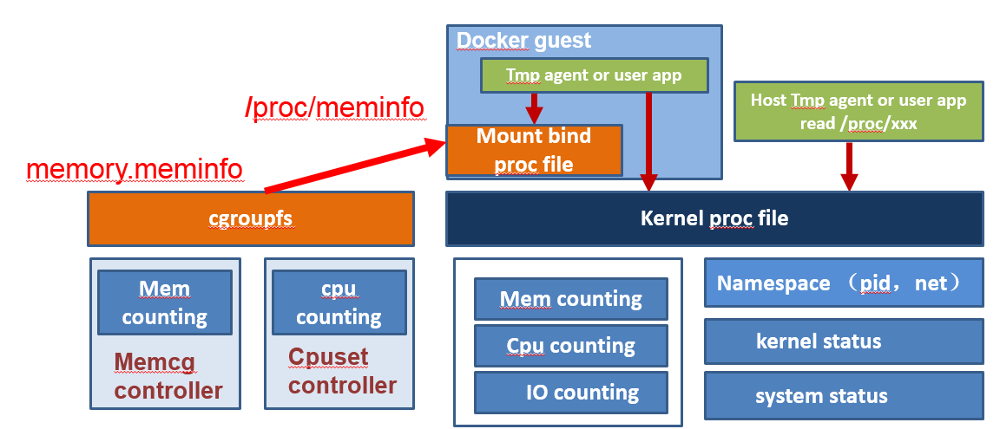

内核在cgroup的memory，cpuset等子系统中分别添加对应的文件输出，然后由用户通过mount bind操作，将同名文件绑定到container的proc中。Mount bind操作可以在docker启动container的流程中添加。

例如：在memeory子系统对应的container目录中添加meminfo和vmstat文件。


在cpu子系统对应的container下实现cpuinfo，stat文件。


**3.**    **文件接口说明**

目前已实现的隔离文件列表如下：

/sys/fs/cgroup/cpuset/system.slice/docker-[id].scope目录下实现：

- cpuset.stat, 对应/proc/stat

- cpuset.cpuinfo, 对应/proc/cpuinfo

- cpuset.loadavg, 对应/proc/loadavg


/sys/fs/cgroup/memory/system.slice/docker-[id].scope目录下实现：

- memory.vmstat, 对应/proc/vmstat
- memory.meminfo, 对应/proc/meminfo

/sys/fs/cgroup/cpuacct/system.slice/docker-[id].scope目录下实现：

- cpuacct.uptime, 对应/proc/uptime,  包含两个字段，第一个字段为容器启动时间，第二个字段为系统空闲时间在容器启动之后的增量。 

/sys/fs/cgroup/blkio/system.slice/docker-[id].scope目录下实现：

- blkio.diskstats, 对应/proc/diskstats

**Uptime隔离的实现**

- /proc/uptime只要用于获取系统启动时间以及系统空闲时间，目前这一接口内核层尚未做隔离。业务一般通过lxcfs模拟实现，lxcfs是通过获取pidns中的init进程的启动时间来确定容器启动时间。为了减低系统的复杂性，我们在此对/proc/uptime做了隔离，相应的入口为cpuacc.uptime。与/proc/uptime类似的，cpuacct.uptime也包含两个字段，第一个字段为容器启动时间，第二个字段为系统空闲时间在容器启动之后的增量。

- 容器启动时间统计逻辑比较简单，在cpuacct子系统创建的时候记录一下系统启动时间并保存到cpuacct私有数据里面，用户cat cpuacct.uptime的时候也记录一下系统启动时间，取两者差值为定义为容器启动时间。值得注意的是，这里统计到的启动时间是不包含系统休眠时间的。

**Diskstats隔离的实现**

- /proc/diskstats用于统计各个块设备的io信息，目前内核尚未对这个接口进行隔离。与/proc/uptime类似，目前业务大多通过lxcfs进行模拟。Lxcfs实际返回的是blkio子系统的一些统计，这里面有个问题blkio子系统的Io统计大多是在cfq调度器里面执行的，如果设备未依赖于cfq调度器，那么相关的统计将失效。其次，blkio部分点的统计时机与disktstats的统计时机不全一致，比如io_serviced cfq是在dispatch阶段统计，而diskstats则是在驱动完成之后统计的。为了降低系统负载性以及提高兼容性，我们对/proc/diskstats接口进行了隔离，相应的入口为blkio.diskstats。

- blkio.diskstats的通过blkcg_diskstats对象统计当前blkcg对特定设备的io量，由于单个blkcg可以访问多个设备，因此blkcg会维护一个blkcg_diskstats队列。由于实际blkcg_diskstats队列长度较短同时为了提高blkcg_diskstats搜索效率，我们设置了一个cache点用于缓存最近命中的blkcg_diskstats对象的地址。Io统计的基本流程是，io提交阶段我们会将bio与blkcg进行绑定，因为end_of_io函数的运行上下文非提交io进程的上下文，因此我们需要通过bio确定相应的blkcg。如果当前bio可以与plug队列，设备dispatch队列或者io调度器内部队列的request合并，此时进行io_merged的统计，Io完成的时候我们对io_sectors，io_serviced, io_wait_time的统计。in_flight，io_ticks, time_in_queue这三个字段与物理设备的处理能力相关，因此我们不单独进行统计，全部填0，然后追加了两个字段将母机侧的io_ticks, time_in_queue的值透传到容器里面。值得注意的是，blkio.diskstats入口默认是关闭的，用户需要通过echo 1 > blkio.diskstats打开方可获取当前cgroup的io统计。基本框架如下所示：

 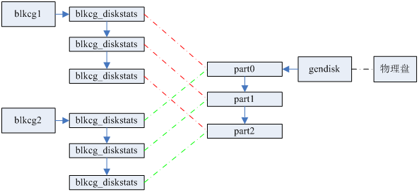


**4.**    **Docker修改**

​     业务如需在docker环境下使用该特性，需要自行修改docker添加相关的mount bind操作。

bind方案需要将host中/sys/fs/cgroup下对应container中的统计信息bind到container命名空间的/proc目录下。要做到这一点需要两个条件，一是必须在container运行起来之后再挂载，因为只有container运行时才会有统计信息输出，二需要在host中能够索引到container的根。满足上述两个条件就需要在docker的容器启动流程中修改添加mount bind操作。

Docker容器启动，容器根切换的大致流程如下：

1. Docker为container分配一个工作目录即container的rootfs，并将container的根设备挂载到这个目录下。

2. Docker将container的根设备host中的一些全局配置如/etc/host等直接mount bind到container根下对应的设备上，其中也包括将主机的/proc挂载到container中，这样container中看到的proc信息是host的。

3. Docker启动container子进程，在子进程中执行change root操作，如此container中就可以看到独立的根了。


需要在第三步中加入对/proc下指定文件的mount bind操作。加入的时机是子进程启动之后，change root之前，change root之后子进程将无法访问host的命名空间了。


**5.**   **mount点隐藏特性**

- /proc/tkernel/shield_mounts, 通过配置该接口，可以隐藏一些不想对容器可见的mount信息, 详细 用法如下:
```shell
echo "set 192.168.1.1:/nfs /nfstest " > /proc/tkernel/shield_mounts 
echo "clear 192.168.1.1:/nfs /nfstest " > /proc/tkernel/shield_mounts 
```


**6.** **iotop支持**

- 因为taskstats不支持net namespace，所以iotop不能在容器里正常运行，通过修改taskstats后，使得iotop能在容器里正常运行。

  

## 内核新增启动参数

- irq_force_manage
	老版本社区内核默认是不允许用户态修改中断亲和性的，完全交给内核来管理，我们默认修改了该行为，使得用户态默认可以修改中断亲和性，当irq_force_manage添加时，回到内核默认行为，即不想允许用户态修改中断亲和性。


## sysctl/proc新增&隔离

### proc新增

- /proc/tkernel/nonpriv_netbind,  通过设置，可以允许非特权用户bind 1024以下的端口,用法如下
  ```shell
  echo +80 > /proc/tkernel/nonpriv_netbind
  echo -80 > /proc/tkernel/nonpriv_netbind
  ```

- /proc/tkernel/shield_mounts,  通过配置该接口，可以隐藏一些不想对容器可见的mount信息, 详细用法参考“ 容器隔离增强”。

- /proc/tkernel/release_suffix, 如果为1，在容器内，uname 命令输出会增加"_docker_guest", 方便需要区别容器内核内核名称。

### sysctl新增

1. kernel.watch_host_pid, 当开启时， 在容器里可以通过/proc/$PID/hostinfo来查看容器内进程的容器外pid, 参考 “容器pid映射信息获取”。

1. kernel.cpuset_cpuinfo_show_realinfo, 当开启时，在容器内的/proc/cpuinfo显示真实的cpu序号, 默认值为0

2. kernel.print-fatal-signals-src-dst , 当开启时，在fatal信号发送处dump出信号和栈，方便定位为什么一些异常信号会被发送，该值默认关闭。

3. kernel.min_epoll_wait_time,  避免用户态错误的使用epoll超时时间，浪费cpu, 默认值为1 HZ, 设为0可以禁掉该功能。

4. net.ipv4.tcp_loss_init_cwnd, 控制进入tcp_enter_loss时的初始拥塞窗口，默认值为1。

5. net.ipv4.tcp_no_delay_ack,  开启后可以立即进入quick ack模式，默认值为0。 并且已按namespace隔离。

6. net.ipv4.tcp_init_cwnd, 可以显示设置tcp初始拥塞窗口。

7. net.ipv4.tcp_rto_min,  net.ipv4.tcp_rto_max, 用户态可以显示控制rto最小，最大值。


### namespace隔离列表

1. net.ipv4.tcp_max_orphans

2. net.ipv4.tcp_workaround_signed_windows

3. net.ipv4.tcp_rmem

4. net.ipv4.tcp_wmem

5. vm.max_map_count, 默认值继承父namespace

### 容器pid映射信息获取


- /proc/$PID/hostinfo， 在kernel.watch_host_pid = 1时， 容器内可以通过读取该文件来获取容器内进程在容器外的真实pid。

```shell
[root@653a04f37e36 /]# cat /proc/self/hostinfo
Name:   cat
NStgid: 31      11194
NSpid:  31      11194
NSsid:  1       11126
```


## page cache limit特性

### 需求分析

- page cache是linux内核的一种文件缓存机制，它主要是用来缓存一些磁盘文件。通过把磁盘文件缓存到内存中，减少系统对磁盘IO的操作，从而提高系统的读写性能。但是，过多的文件缓存，会占用大量的系统内存，可能会导致系统剩余内存不足，反而会影响业务的性能或使用。因此，在某些场景下，我们需要限制page cache的使用率，尽量使系统剩余的内存能够满足业务的需求。

- 现有的linux内核中已有回收page cache的机制：进程分配内存时，如果系统的剩余内存低于一定值(与/proc/sys/vm/min_free_kbytes相关)时，就会进入slow path，唤醒kswapd进程回收一些page cache，如果kswapd没有回收成功或者回收较慢，则进入到direct_reclaim进行深度的回收，直到系统剩余内存满足要求，如果还是不行，那么只能OOM了。这样的机制是否足够了呢？

- 在一些原子操作的场景，比如中断上下文中，是不能睡眠的，因此在这种场景下的内存分配时，是不会进入到direct_reclaim环节，甚至也不会去唤醒kswapd进程的。比如在网卡收包的软中断处理函数中，可能存在因为page cache占用过多，系统剩余内存不足，无法为收到的数据包分配内存，而直接丢包的现象。这也就是page cache limit要解决的问题。

### page cache介绍

- page cache是linux内核实现的一种磁盘文件缓存，它主要用来减少对磁盘的IO操作，具体地讲，是通过把磁盘中的数据缓存到物理内存中，把对磁盘的访问变为对物理内存的访问。目的是提高文件的访问性能。那么page cache是什么时候生成的呢，保存到哪里呢？

- page cache在系统中的大致位置，如下图所示：

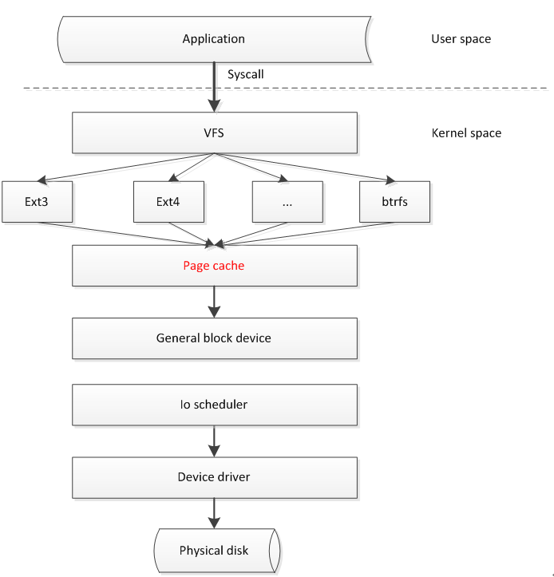


- 比如，当应用程序读取磁盘数据时，首先会调用find_get_page()函数，来判断系统中是否有对应的page cache，如果有，而且是有效的最新数据，则就会直接返回读取到的数据，无需访问磁盘。

- 如果系统中没有对应的page cache，则会调用对应的文件系统，触发磁盘读操作。当数据读取到并返回时，就会调用add_to_page_cache_lru()，将刚刚读取到的数据pages缓存到lru列表中。lru列表会对page cache进行管理，根据其访问的活跃程度，分为active list和inactive list两个列表管理，关于lru的详细管理机制可以参考网络文章。

### page cache limit实现分析

- page cache limit主要就是在应用程序添加page cache时（即调用add_to_page_cache_lru函数时），来检测page cache是否超过了我们设置的上限(/proc/sys/vm/pagecache_limit_ratio)。

- 如果检测到page cache超过限额，就会调用shrink_page_cache()来回收page cache，可见这个函数是page cache limit回收page cache的核心函数。

- shrink_page_cache()回收page cache，直到低于page cache的阈值，回收顺序如下：

  1.  回收lru inactive_list中的page caches。

  2.  回收lru active_list中的page caches，但不回收映射页、匿名页和脏页。

  3.  回收lru active_list中的page caches，但不回收映射页、匿名页，如果pagecache_limit_ignore_dirty为0，会收回脏页。


- 注：上面的步骤不一定全部走完，只要低于page cache的阈值，就会退出回收过程。这里之所以不回收匿名页和映射页，是因为匿名页需要swap，比较耗时，而映射页是只映射到进程的页表里的pages，也是不能回收的。

### page cache limit功能介绍及使用

- 我们提供了3个/proc接口，分别为

   ```shell
   /proc/sys/vm/pagecache_limit_ratio
   ```

   默认值为0，表示不开启page cache limit功能。通过echo x > /proc/sys/vm/pagecache_limit_ratio（0 < x < 100）开启page cache limit功能。非0时，比如：30，表示限制page cache占系统总内存的30%；

- ```shell
   /proc/sys/vm/pagecache_limit_reclaim_ratio
   ```

   page cache真实回收的比例，为了防止频繁的page cache回收抖动，我们会多回收一些page cache，默认比pagecache_limit_ratio多2%；

- ```shell
   /proc/sys/vm/pagecache_limit_ignore_dirty
   ```

   计算page cache占用内存时，是否忽略dirty pages。默认值是1，表示忽略。因为dirty pages的回收是比较耗时的。

- ```shell
   /proc/sys/vm/pagecache_limit_async
  ```

   page cache的回收方式

   - 为1时，表示异步回收page cache，这时，会创建一个 [kpclimitd]内核线程，由这个线程负责page cache的回收。

   - 为0时，不会创建任何专用回收线程，直接在page cache limit触发的进程上下文回收。

   - 默认值为0，表示同步回收。

   - 优缺点对比：

     异步回收的好处就是，回收的开销不会发生在业务进程的上下文，但不足就是无法准确控制page cache的使用比例，仍然可能发生OOM。
  
     同步回收的好处是，可以较为准确的控制page cache的使用比例，但可能给业务进程本身带来一定的开销，发生时间毛刺。所以，还要看具体的业务场景需求而合理的设置。


### 结论

经过测试，已经能够按照用户的设置，限制page cache的比例。而且在1Gbit/s速度的IO读写流中，page cache limit带来的额外cpu开销低于3%。但减少系统的page cache，可能会增加一定的cache miss，但一般情况下，我们也不会把page cache限制过低，这个可以根据业务场景需求进行适当的调整。


## 热补丁

- x86,  x86热补丁，我们的内核默认合入了kpatch内核模块，可以自行选择是用内核自带的livepatch，或者kpatch。
- ARM64, arm64默认不支持热补丁，我们的内核在社区内核的基础上支持了热补丁特性，参加下面章节。

  

## ARM64 热补丁

### 热补丁简介

内核热补丁技术是一种无需重启服务器，即可实现修改内核运行时代码的技术。基于该技术，可以在不影响业务正常运行的情况下，修复内核bug或者安全漏洞，以提高运营效率、底层平台的稳定性和可用性，并使得业务运营体验有效提升。

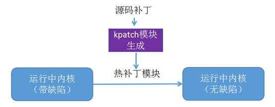


### 工作原理

目前不同厂商都推出了自己的热补丁技术，包括Ksplice、Kgraft、Kpatch、Livepatch。这几种方案从实现原理上讲大同小异，对x64架构都做了充分的验证，但一直缺乏对arm64架构的支持。业界也没有相应的解决方案。

随着内核对外版发布，需要我们支持的架构也包含了arm64，随着arm64机型的大量部署。arm64热补丁技术需求变得尤为迫切。

由此，我们基于**Kpatch框架**开发了arm64热补丁特性。

arm64热补丁功能实现包括内核、编译器、用户态工具几部分。

### 内核态工作原理

kpatch在内核中是基于ftrace实现内核函数的替换，类似于ftrace的动态探测点，不过不是统计某些运行数据，而是修改函数的运行序列：在函数运行某些额外的代码之后，略过旧函数代码，并跳转至新函数。框架如下图所示：

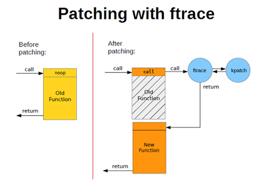


针对arm64架构，整个流程可以细化为下图所示：


### 用户态工作原理


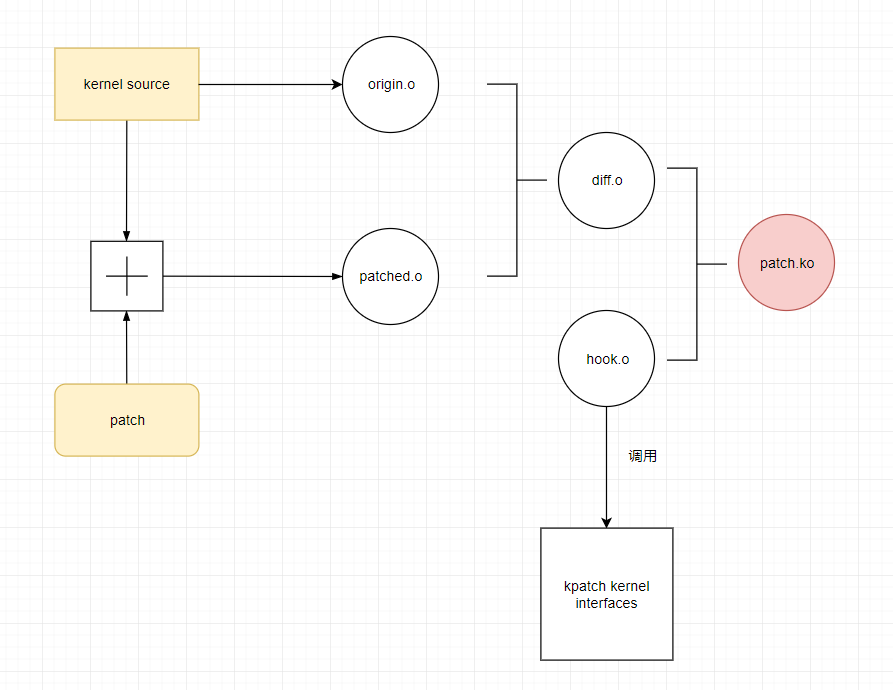


1. 通过kernel 源码编译内核
2. 打上补丁后再次编译内核
3. 分析两次目标文件的变动情况，生成diff.o
4. diff.o通过包装生成最终的patch.ko
5. ko文件里面调用内核的接口，通过插入该模块完成热补丁部署

### 内核态改造

#### 使用patchable-function-entry实现类似于fmentry功能（使用了GCC 8.2.1版本）

**x86机器上：**


x86机器上，如果使用-mfentry，elf文件中ftrace跳转指令位于prologue前面，在由旧函数跳转到新函数后，执行指令流程不会出错。如果使用mcount，则在新函数前需要添加stub函数，用于处理栈信息等。**arm64机器上：**

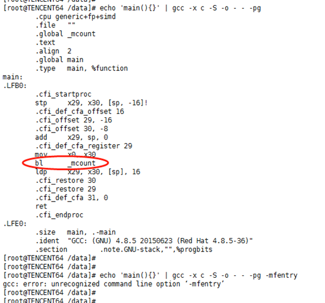


Arm64只支持mcount功能，但是arm64 prologue会对寄存器做修改，所以无法使用stub函数来适配。所以采用gcc patchable-function-entry来实现类似于mfentry的功能。使用了GCC 8.2.1版本来编译内核.


#### ftrace regs 实现

热补丁中涉及到修改regs参数，所以在ftrace跳转时需要将寄存器入栈，所以针对arm64，实现了ftrace with regs功能，为热补丁功能做准备。x0 ~ x30入栈操作如下：

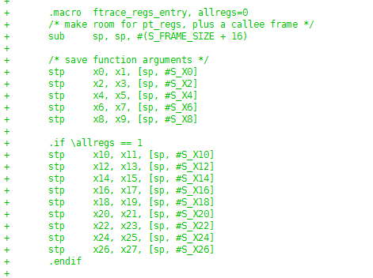


#### kpatch arm64支持

包括ftrace_ops注册删除、模块载入时数据重定位等功能。
重定位简要代码如下：

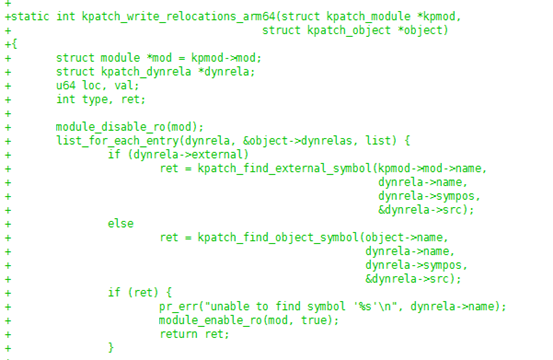


#### 用户态工具改造

通过前面的用户态工作原理的介绍我们可以看出，我们生成diff.o时，没法借助编译器的力量，需要手动解析

**1ELF 文件**
ELF 文件分为三类

- **目标文件（obj文件）**
  目标文件仅仅是编译生成的，在目标文件中，有专门的信息来标识没有识别到的符号。
  我们在C语言中，我们通常用函数来作为代码的组成的最小单位。但是构成obj文件的基本单位是section。不同的section作用也不同。通常我们可以看到的有text section，data section等等
- **可执行文件**
  可执行文件由多个目标文件链接而成，通过链接，可以确定每个符号在内存中的具体地址。
- **动态可链接文件（so库**）
  内核的实现仅用倒了目标文件和可执行文件。

**2、链接过程**
目标文件中有一个很重要的*section——relocation section*。
基本上链接上的重点都是围绕这个section展开的。
relocation section可以看作是一个数组，数组中的每一项可以看作一个三元组
`（addr，symbol，filling_function）`
这个三元组表达的意思可以用C伪代码来表示：
`*addr = filling_function(symbol, addr)`

通过对各个目标文件进行链接，可以生成最终的可执行文件。链接过程主要解决以下问题：

1. 整合各个section，比如所有obj文件中的text段即可以合并在一起。
2. 符号决议。整合之后便可以确定每个符号的运行时地址，即确定每个obj文件中引用的不在本目标文件中的符号存在。
3. 确定每个符号的地址，并根据relocation section中的每一项完成重定位。

filling_function 在不同的架构下规则不同，在arm64架构中，主要有以下几种重定位类型：

```
1.    R_AARCH64_ABS64
符号运行时的绝对运行地址，即

*addr = symbol.addr

2.    R_AARCH64_PREL32

*addr = symbol.addr - addr

3.    R_AARCH64_CALL26
该指令为arm br指令重定位
*addr = symbol.addr - addr

4.    R_AARCH64_ADR_PREL_PG_HI21

*addr = Page(symbol.addr) - Page(addr)

5.    R_AARCH64_ADD_ABS_LO12_NC

*addr = symbol.addr[11:0]
//symbol.addr 的 bit 11 ~ bit 0
```

**3、kernel module**
明白了链接过程的原理，其实大体就可以明白kernel module的工作方式了。
可以简单的说，内核把链接器的工作搬到了内核中，这样内核就可以加载目标文件了。ko文件的本质就是目标文件，只不过加了一些别的section用来描述你的kernel module。当你insmod的时候，内核就会解析ko文件中的relocation section，帮你决议符号，成功后你的代码就可以被运行了。
有一点需要注意的是，kernel module虽然把连接工作放到了内核去做，但是由于各种开源协议的原因，他只会帮你决议通过EXPORT_SYMBOL_XXX导出的符号。

- 1、找到变动的函数
  上面说到，一个目标文件是通过不同的section来组成的，那么我们可以通过比对对应的段，来找到不同。可麻烦的是，所有的函数都被编译到text段中，我们通过逐个字节比对，可以找到text段是否变动，但是很难办法找到哪个函数变动。
  好在编译器提供了特定的编译选项，将每个函数和全局变量单独成立一个section，其section name和函数名或者变量名一一对应，这样我们就可以轻易找到变动的函数。
- 2、 生成 arm64 架构的diff.o
  通过比对，我们可以找到变动的section，那么也就能找到对应的函数。剩下的问题是，如何生成diff.o。我们需要考虑以下几个问题：
  1. 由于生成diff.o不是通过C代码生成的，所以我们需要借助一些工具手动构造一个obj文件。
     这个问题可以通过libelf来解决，利用这个库，可以手动生成一个新的obj文件。
  2. 变动的函数可能引入新的全局符号。
     新的全局符号可能是新的全局变量，或者新的函数，那么肯定会产生新的section，我们将这些section也一并放到diff.o里面。
  3. 变动的函数会调用系统中已经存在的符号。
     我们可以利用relocation section，让内核帮我们处理掉他。原理和kernel module加载过程一致。
     但是我们需要让他帮我们决议所有的内核符号。

由于上述的分析都是基于分析arm64 的elf文件来实现的，所以我们需要对照arm64的elf规范进行实现。

###  验证

首先需要载入kpatch模块，然后载入用户态工具生成的新函数模块。通过lsmod查看模块是否载入成功。同时kpatch提供了sysfs接口，可以查看载入新函数模块的信息，包括新旧函数地址等。可以通过`/sys/kernel/kpatch/xxx/enabled`来卸载模块，恢复执行原函数。
简要操作流程如下：

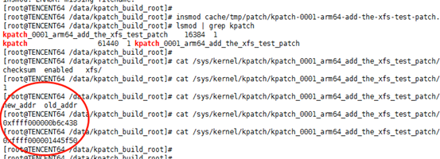


## 进程防gdb功能

进程防gdb功能，可以让进程在设置保护后，即使是root也不能gdb该进程，阻止跨进程获取内存，加载动态库等。gdb是通过ptrace系统调用来实现的，我们的内核通过在ptrace调用里增加判断条件实现到阻止进程被gdb的功能，ptrace改动如下：

 ```c
  --- a/kernel/ptrace.c
  +++ b/kernel/ptrace.c
  @@ -1118,6 +1118,9 @@ static struct task_struct *ptrace_get_task_struct(pid_t pid)
   #define arch_ptrace_attach(child)      do { } while (0)
   #endif
  
  +int (*ptrace_pre_hook)(long request, long pid, struct task_struct *task, long addr, long data);
  +EXPORT_SYMBOL(ptrace_pre_hook);
  +
   SYSCALL_DEFINE4(ptrace, long, request, long, pid, unsigned long, addr,
                  unsigned long, data)
   {
  @@ -1136,6 +1139,12 @@ SYSCALL_DEFINE4(ptrace, long, request, long, pid, unsigned long, addr,
                  ret = PTR_ERR(child);
                  goto out;
          }
  
  +       
  +       if (ptrace_pre_hook) {
  +       ret = ptrace_pre_hook(request, pid, child, addr, data);
  +       if (ret)
  +       goto out_put_task_struct;
  +       }
 ```

  其中ptrace_pre_hook回调指针，在ttools内核模块里赋值，实现。ttools模块初始化会创建字符控制设备/dev/ttools, 并且提供两个ioctl来让用户态进程把自身 加入/移除 gdb防护列表。

```c
#define TTOOLS_PTRACE_PROTECT       _IO(TTOOLS_IO, 0x00)
#define TTOOLS_PTRACE_UNPROTECT     _IO(TTOOLS_IO, 0x01)
```
用户态需要先modprobe ttools，加载ttools内核模块，然后使用类似以下代码逻辑来将进程加入/移除gdb防护列表, 内核模块ttools实现参见kernel/tkernel/ttools。

```c
//ttoos.h
#ifndef __TTOOLS_H__
#define __TTOOLS_H__

#include <linux/types.h>
#include <linux/ioctl.h>

#define TTOOLS_IO 0xEE

struct ttools_fd_ref {
        int fd;
        long ref_cnt;
};

#define TTOOLS_PTRACE_PROTECT           _IO(TTOOLS_IO, 0x00)
#define TTOOLS_PTRACE_UNPROTECT         _IO(TTOOLS_IO, 0x01)
#define TTOOLS_GET_FD_REFS_CNT          _IOWR(TTOOLS_IO, 0x02, struct ttools_fd_ref)

#endif
```

```c
//ttools_demo.c
#include <stdio.h>
#include <stdlib.h>
#include <unistd.h>
#include <sys/types.h>
#include <sys/ioctl.h>
#include <sys/stat.h>
#include <fcntl.h>
#include <errno.h>
#include "ttools.h"

#define handle_error(msg) \
     do { perror(msg); exit(1); } while (0)

int main()
{
        int fd;
        int ret;
    
        fd = open("/dev/ttools", O_RDONLY); 
        if (fd == -1)
                handle_error("open ttools dev failed");
    
        if (ioctl(fd, TTOOLS_PTRACE_PROTECT, 0))
                handle_error("ioctl protect failed");
    
        sleep(60);
    
        if (ioctl(fd, TTOOLS_PTRACE_UNPROTECT, 0))
                handle_error("ioctl unprotect failed");
        close(fd);
    
        return 0;

}
```


## 离线调度算法(BT)

### 特性简介
一种适用于离线业务的全新调度算法。使用了该算法的离线业务，对在线业务的运行几乎没有影响，可以有效提升系统的CPU利用率。
### 研发背景
目前互联网企业都拥有海量的服务器，其中大部分只运行交互类延时敏感的在线业务，使CPU利用率非常低，造成资源的浪费（据统计全球服务器CPU利用率不足20%）。为提高服务器CPU的利用率，需要在运行在线业务的服务器上，混合部署一些高CPU消耗且延时不敏感的离线业务。然而，现有的实现在混部后在线业务的服务质量下降严重，甚至无法进行混部。所以需要一种针对离线业务的新的调度算法。
### 业界现有方案对比
目前业界通用的混部方案在离在线业务使用的调度算法这一层是没有区别的，都是CFS算法，只是使用cgroup进行彼此隔离，然后使用cpu子系统的shares和quota机制来控制离在线业务CPU的使用限制。这种方案同样可以提升CPU利用率，但离线业务的运行会影响在线业务的服务质量，尤其是时延非常敏感的在线业务。所以应用场景有限，不具备普适性。
另外，内核提供了SCHED_BATCH和SCHED_IDLE两种优先级比较低的调度算法，但它们仍然和CFS共用相同的实现，尤其是在负载均衡时是未做区分的，它们是没有完全的和CFS隔离开来，所以效果上面介绍的通用方案存在类似的问题。
### 设计原理
业界现有混部方案无法普遍适用，问题就在离在线业务在调度算法这一层次没有做区分，造成：如果离线业务在运行时，在线业务到来无法及时的抢占CPU；再者，在做负载均衡时，无法区分离在线业务，造成在线业务挤占相同的CPU，无法均匀合理的分散到所有所有CPU上。
为此，好的混部方案就是将离在线业务彻底分开，所以在调度算法这一层次就要做区分。基于这种考虑，开发了针对离线业务的新调度算法bt，该算法可以保证在线业务优先运行。新调度算法的基本算法借鉴于CFS，但在CPU选择、抢占、负载均衡、时延处理、CPU带宽控制等多个方面都有自己的特点和要求，有特有的处理方式。特别是配有特有的负载均衡策略、CPU带宽控制策略等。
整个的运行机制如下图:

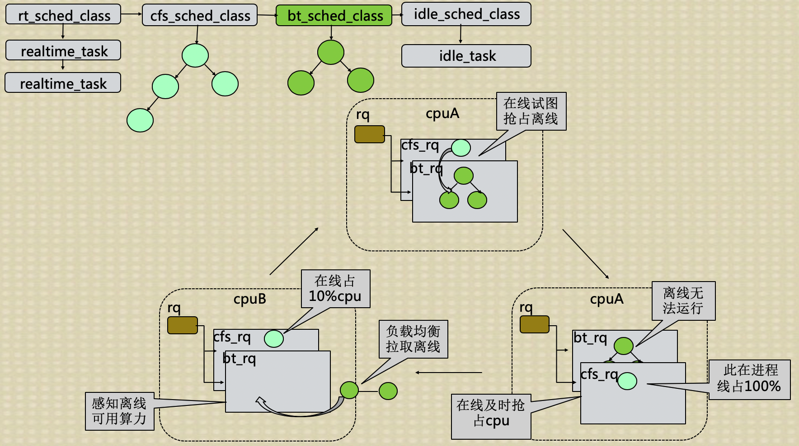

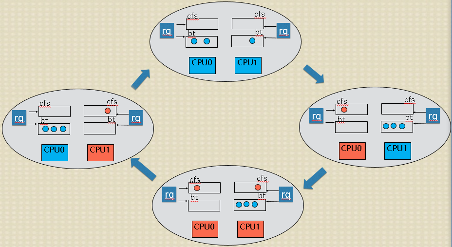

其中：蓝色代表使用新离线调度算法bt的离线业务；橙色代表在线业务；CPU的颜色代表哪种业务在运行。通过运行切换图可以看到：1、只有离线业务时，如同CFS一样可以均匀的分散到CPU上；2、在线业务需要运行时，可以及时的抢占离线业务占用的CPU，且将离线业务排挤到其它离线业务占用的CPU上，这样在线业务及时得到运行且离线也会占用剩余CPU，存在个别离线业务无法运行的情况；3、在线业务较多时，可以均衡合理的占用所有CPU，此时离线业务抢不到CPU；4、在线业务休眠时，离线业务可以及时的占用在线业务释放的CPU。
### 业务场景效果
目前混部方案的效果腾讯各BG多种业务场景下得到了验证，功能满足业务需求，在不影响在线业务的前提下，整机cpu利用率提升非常显著，超过业务预期。下面列举几个业务场景：

- 场景A
	如下图所示，在A测试场景中，模块a一个用于统计频率的模块，对时延非常敏感。此业务不能混部，整机CPU利用率只有15%左右，业务尝试过使用cgroup方案来混部，但是cgroup方案混部之后，对在线模块a影响太大，导致错误次数陡增，因此此模块一直不能混部。使用我们提供的方案之后，可以发现，CPU提升至60%，并且错误次数基本没有变化。
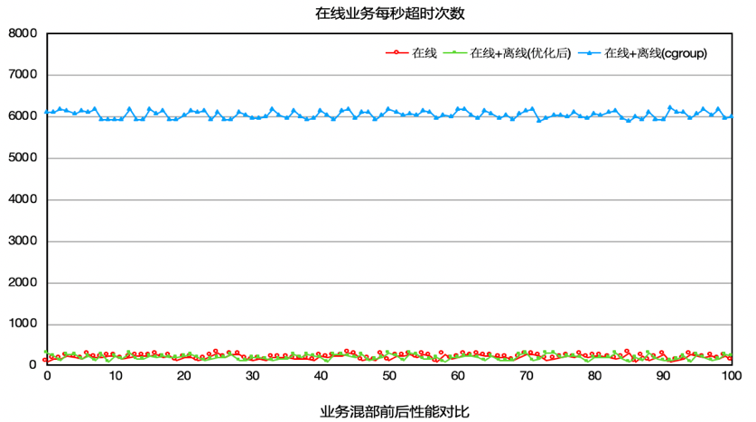
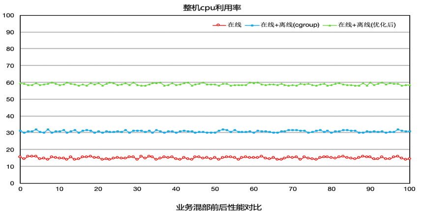


- 场景B
   在B测试场景中（模块b是一个翻译模块，对时延很敏感），原本b模块是不能混部的，业务尝试过混部，但是因为离线混部上去之后对模块b的影响很大，时延变长，所以一直不能混部。使用我们的方案的效果如下图所示，整机CPU利用率从20%提升至50%，并且对模块没有影响，时延基本上没有变化
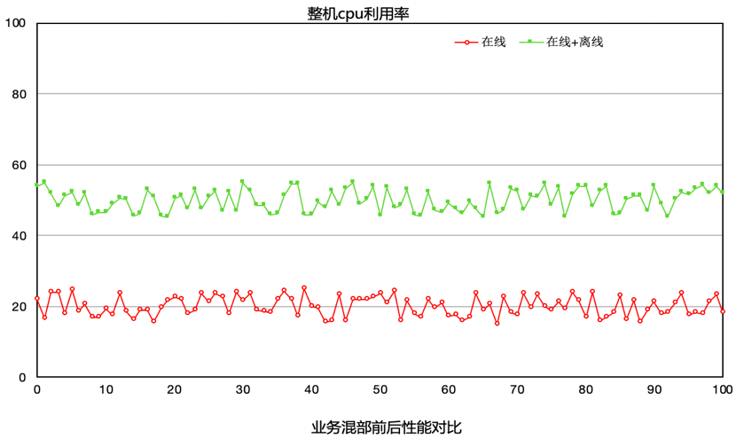


- 场景C
   模块C对时延不像场景A，B那么敏感，所以在使用我们提供的方案之前，利用cgroup方案进行混部，CPU最高可以达到40%。但是平台不再敢往上压，因为再往上压就会影响到在线c业务。如下图所示，使用我们的方案之后，平台不断往机器上添加离线业务，将机器CPU压至90%的情况下，c业务的各项指标还是正常，并没有受到影响。
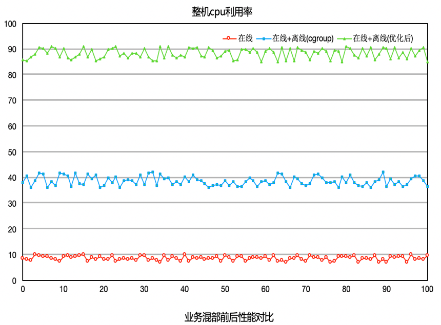

上面列的是腾讯内部使用BT调度算法的效果。有兴趣的同学可以在自己的业务场景中进行适用，真实的去体验腾讯离在线混部方案的效果。具体使用方法详见下面的使用指南。

### 使用方法
我们提供了一个启动参数offline_class来支持用户程序使用离线调度。
设置offline_class即使能了离线调度，用户可以通过sched_setscheduler函数把一个进程设置成离线调度：


其中7表示离线调度。
设置成功后，我们可以用top比较下设置前后进程的优先级变化，
设置前：


设置成离线调度后：


通过设置kernel.sched_bt_period_us和kernel.sched_bt_runtime_us这两个内核参数，我们可以控制离线进程占用的cpu比例。
默认情况下kernel.sched_bt_period_us=1000000，kernel.sched_bt_runtime_us=-1，表示控制周期是1s，离线进程占用cpu不受限制，比如，我们设置kernel.sched_bt_runtime_us=100000，即离线占用10%的cpu：


__统计离线进程所占cpu比例__
通过查看/proc/bt_stat文件，可以查看系统中离线进程所占用的cpu比例：

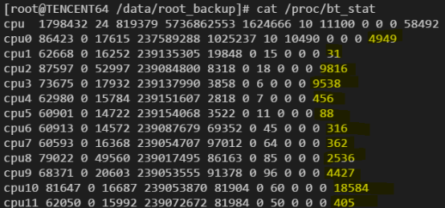

该文件的结构和/proc/stat类似，只是在每个cpu的最后又增加了一列，表示该cpu上离线进程运行的时间。

__离线调度对docker的支持__
在docker中使用离线调度，我们可以同上面讲的一样，调用sched_setscheduler将docker中的进程设置为离线，或者在启动容器时，将容器的1号进程设置成离线，这样容器内再启动的其他进程也自动是离线的。

为了更好的支持docker，离线调度在cgroup的cpu目录下会新增几个和离线调度相关的文件：


cpu.bt_shares：同cpu.shares，表示该task group的share比例。
cpuacct.bt_stat,cpuacct.bt_usage,cpuacct.bt_usage_percpu_sys,
cpuacct.bt_usage_percpu_user,cpuacct.bt_usage_sys,cpuacct.bt_usage_user同cfs的相应文件一样，只不过统计的是该task group中的离线进程数据。

## NVME IO隔离

### 研发背景
内核通用块层通过io throttle，以cgruop的形式来限制iops 和bps。同时在IO调度层，内核通过各种调度器来实现按权重比例隔离。

因为mq设备通常不经过调度层，所以无法按照权重隔离。该补丁的实现，就是基于io throttling动态调节bps limit，最终实现通用层的权重隔离。

### 设计思路
以前在io throttling中，我们可以通过cgroup限制处于同一个cgroup的进程针对某个设备的bps值。那如果我们能够及时获取当前块设备的实时带宽，那么通过动态按照权重调节该值即可实现该功能。
为了避免浪费带宽，我们对于一段时间没有产生io的cgroup，够剥夺他们的权重，供其他cgroup使用，保证利用率最大化。

对于每个cgroup，我们引入两个权重来表示他们的权重之和
* leaf weight
该cgroup**自身**与**一级子节点**之间的权重关系
* weight
决定了**本节点**占用**父节点**权重


### 计算方式：
```
对于某cgroup，记作c
c.sum = c.leaf_weight + Σc.child[i].weight 其中c.child[i].weight为该cgroup的所有直系子cgroup的weight值

对于root节点，其可享受到的带宽比例为100%
对于非root cgroup `c` 可以享受到的带宽比例为
c.weight / c.parent.sum
```
### 使用方法
在blkio cgroup目录下，有以下两个文件
`blkio.throttle.leaf_weight_device`
`blkio.throttle.weight_device`

对该两个文件的配置方式为
```
echo major:min $weight > $file
#其中：
# major和 min对应块设备（不可以是partition）
# weight 的范围为 10 ~ 1000
# file 即上述的两个cgroup配置接口文件
```
### 使用场景举例
```
echo "259:2 800 > /sys/fs/cgroup/blkio/blkio.throttle.leaf_weight_device"
echo "259:2 200 > /sys/fs/cgroup/blkio/offline_tasks/blkio.throttle.weight_device"
```

以上表示我们希望针对259:2 设备，root cgroup的权重是 offline_tasks的4倍。当root节点持续一段时间对该设备没有io后，其权重会全部被offline_tasks节点瓜分。
